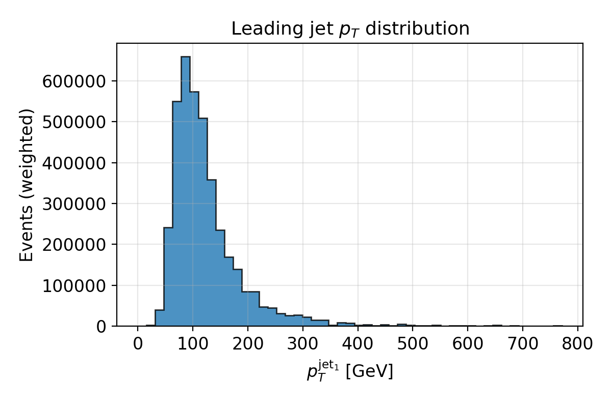
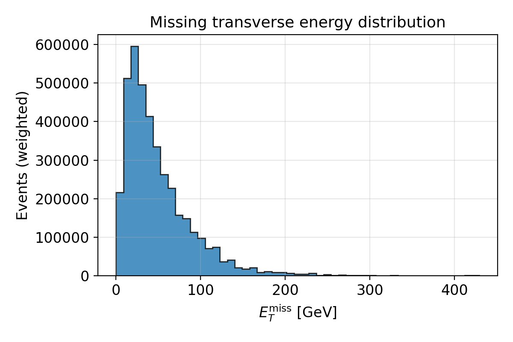
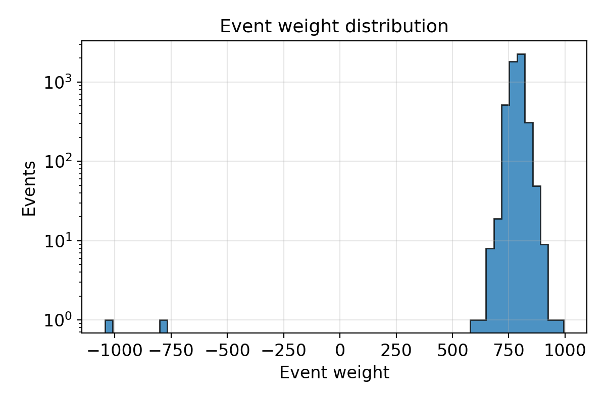
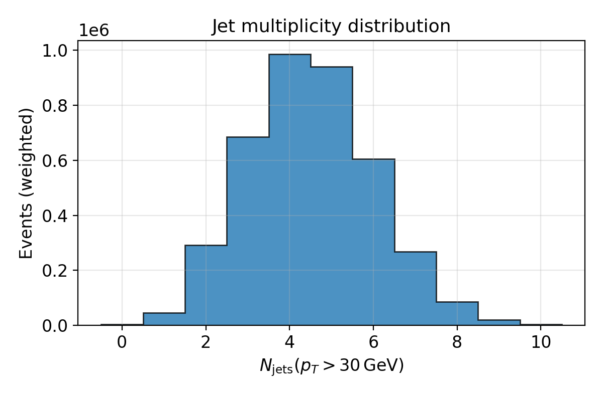
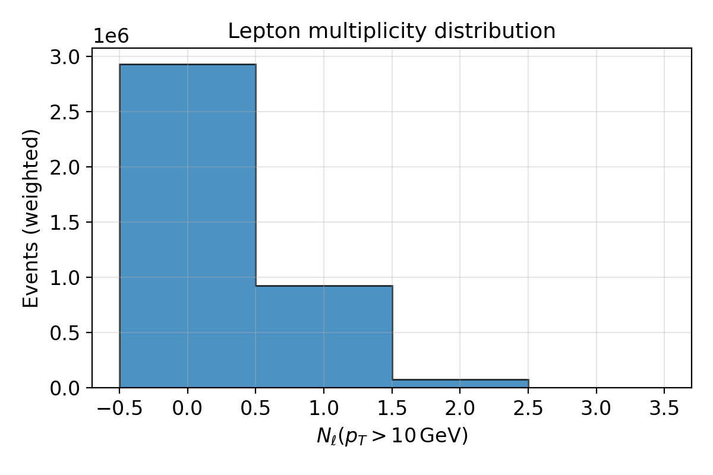

# UFO EFT $pp \to t\bar t$ dataset documentation

## 1. Introduction and overview

This document describes a simulated dataset of effective-field-theory (EFT) top–antitop production at the LHC, including detector effects at Delphes level. The central artifact is the NumPy archive

- `/output/dataset/output/dataset/ufo_ttbar_reweighted.npz`

which contains $N = 100000$ events with reconstructed jets, electrons, muons, missing transverse energy (MET), and per-event weights.

The hard-process signal is $pp \to t\bar t$ at $\sqrt{s} = 13\,\text{TeV}$, generated with MadGraph5\_aMC@NLO (MG5\_aMC), interfaced to Pythia8 for parton showering and hadronization, and Delphes 3 for fast detector simulation. An EFT dimension-6 chromomagnetic operator with Wilson coefficient $c_{tG}$ is activated in the UFO model `dim6top_LO_UFO`. The parton-level EFT sample is generated at leading order (LO) in QCD and then reweighted with an $m_{t\bar t}$-dependent $K$-factor extracted from Standard Model (SM) LO and next-to-leading order (NLO) $t\bar t$ samples.

This documentation aims to make the dataset reproducible and interpretable for particle-physics PhD students and practitioners. It covers

- the software environment and recommended installation,
- the physics setup and modeling assumptions,
- the event-generation and reweighting pipeline from hard process to NPZ file,
- the structure and meaning of each NPZ field, and
- verification steps and known limitations.

## 2. Software environment and installation

### 2.1 Generator stack (explicit information)

The dataset was produced with the following generator stack and tools. Items marked "explicit" are read directly from configuration files and logs.

- **MadGraph5\_aMC@NLO core** (explicit)
  - Version: 3.7.0.
  - Evidence: `/opt/MG5_aMC/VERSION` and the banner at the top of `/output/dataset/output/log.txt`.

- **MadGraph template versions** (explicit)
  - LO and UFO processes (`proc_sm_lo_ttbar`, `proc_ufo_parton_ttbar`): `TemplateVersion.txt = 2.5.0`.
  - NLO process (`proc_sm_nlo_ttbar`): `TemplateVersion.txt = 2.4.31`.

- **LHAPDF** (explicit)
  - Interface version: 6.5.5.
  - Evidence: MG5 log messages ("Using LHAPDF v6.5.5 interface for PDFs"), and `lhapdf-config --version` under `/opt/MG5_aMC/HEPTools/lhapdf6_py3`.

- **Pythia8** (semi-explicit)
  - Installed under `/opt/MG5_aMC/HEPTools/pythia8`.
  - The installation log refers to unpacking `pythia8316`, consistent with Pythia 8.316.
  - Exact minor version is not recorded in the dataset area but is expected to be 8.316.

- **Delphes** (semi-explicit)
  - Installed under `/opt/MG5_aMC/Delphes`.
  - The README describes installation from `Delphes-3.5.0.tar.gz`, consistent with Delphes version 3.5.0.

- **MG5–Pythia8 interface** (explicit)
  - Path: `/opt/MG5_aMC/HEPTools/MG5aMC_PY8_interface`.
  - Registered in `/opt/MG5_aMC/input/mg5_configuration.txt` and in the UFO process card.

- **UFO model** (explicit)
  - Name: `dim6top_LO_UFO`.
  - Location: `/opt/MG5_aMC/models/dim6top_LO_UFO`.
  - Used in `mg5_ufo_parton_ttbar.mg5` via `import model /opt/MG5_aMC/models/dim6top_LO_UFO`.

All three MG5 processes (SM LO, SM NLO, and EFT UFO) use LHAPDF with `pdlabel = lhapdf` and PDF set ID `lhaid = 303400`.

### 2.2 Python environment (inferred)

The analysis and conversion scripts are Python 3 programs. In the current container, the environment is:

- **Python:** 3.11.2 (inferred via `python3 --version`).
- **NumPy:** `numpy==2.3.5` (inferred).
- **Awkward Array:** `awkward==2.8.11` (inferred).
- **Uproot:** originally installed for the generation run, but the exact version is not recorded. A modern version compatible with Python 3.11, NumPy 2.x, and Awkward 2.x (for example `uproot~=5.3`) is recommended for reproduction.

These library versions are not guaranteed to match exactly those used in the original run but are physically compatible. Exact bitwise reproducibility is therefore not guaranteed, but physics-level reproducibility (distributions and cross sections within statistical uncertainties) is expected.

### 2.3 Clean-machine installation recipe (recommended)

This subsection presents a concrete installation recipe for a new Linux machine. Paths can be adapted as needed; the original project assumes

- MG5\_aMC at `/opt/MG5_aMC`, and
- the project directory at `/output/dataset`.

If these locations are not writable, you can install elsewhere and either adjust the paths in `run.sh` and the `.mg5` cards or create suitable symbolic links.

#### 2.3.1 System prerequisites (example for Debian/Ubuntu)

```bash
sudo apt-get update
sudo apt-get install -y \
  python3 python3-venv python3-pip \
  gfortran g++ make \
  wget curl tar gzip \
  cmake pkg-config \
  libz-dev
```

#### 2.3.2 Python virtual environment for analysis

```bash
python3 -m venv ~/envs/ufo_ttbar
source ~/envs/ufo_ttbar/bin/activate

pip install --upgrade pip
pip install \
  "numpy==2.3.5" \
  "awkward==2.8.11" \
  "uproot~=5.3"  # inferred; any recent 5.x compatible with Awkward 2.x
```

#### 2.3.3 Install MG5\_aMC 3.7.0 and HEP tools

```bash
cd /opt
sudo mkdir -p MG5_aMC
sudo chown "$USER":"$USER" /opt/MG5_aMC

cd /opt
# Download the official MG5_aMC v3.7.0 tarball from the MG5_aMC website
wget <MG5_aMC_3.7.0_tarball_url> -O MG5_aMC_v3_7_0.tar.gz
tar -xzf MG5_aMC_v3_7_0.tar.gz
mv MG5_aMC_v3_7_0/* MG5_aMC/
rm -rf MG5_aMC_v3_7_0 MG5_aMC_v3_7_0.tar.gz

cd /opt/MG5_aMC
./bin/mg5_aMC << 'EOF'
install lhapdf6
install pythia8
install Delphes
install mg5amc_py8_interface
EOF
```

This will populate

- `/opt/MG5_aMC/HEPTools/lhapdf6_py3`,
- `/opt/MG5_aMC/HEPTools/pythia8`,
- `/opt/MG5_aMC/Delphes`, and
- `/opt/MG5_aMC/HEPTools/MG5aMC_PY8_interface`,

and will update `/opt/MG5_aMC/input/mg5_configuration.txt` with the appropriate paths for Pythia8 and the interface.

#### 2.3.4 Install the UFO model `dim6top_LO_UFO`

```bash
cd /opt/MG5_aMC/models
# Download dim6top_LO_UFO from its official source
tar -xzf /path/to/dim6top_LO_UFO.tar.gz
# This should create /opt/MG5_aMC/models/dim6top_LO_UFO
```

Verify that the directory `/opt/MG5_aMC/models/dim6top_LO_UFO` exists and contains UFO model files such as `particles.py`, `parameters.py`, `vertices.py`, etc.

#### 2.3.5 Place this project

```bash
sudo mkdir -p /output
sudo chown "$USER":"$USER" /output

cd /output
tar -xzf /path/to/ufo_ttbar_dataset_project.tar.gz
# Result: /output/dataset with run.sh, scripts/, output/, documentation/, etc.
```

If you choose a different root (for example `$HOME/ufo_ttbar_dataset` instead of `/output/dataset`), update the hard-coded paths in `run.sh` and in the `.mg5` cards or provide suitable symlinks.

### 2.4 Explicit vs inferred versions

For clarity:

- **Explicit versions (from logs/configs):**
  - MG5\_aMC core 3.7.0, template versions 2.5.0 (LO/UFO) and 2.4.31 (NLO).
  - LHAPDF 6.5.5.
  - Pythia8 approximately 8.316 (from installation log).
  - Delphes 3.5.0 (from README).
  - UFO model `dim6top_LO_UFO` (exact internal version not specified in the dataset area).

- **Inferred Python environment:**
  - Python 3.11.2, NumPy 2.3.5, Awkward 2.8.11.
  - Uproot: any recent 5.x compatible with the above; exact original version unknown.

Exact bitwise reproduction of the dataset is not guaranteed, but reproductions with the versions above should agree within statistical uncertainties.

## 3. Physics and modeling assumptions

### 3.1 Processes and models

Three MG5 processes are used in the pipeline:

1. **SM LO $pp \to t\bar t$**
   - Card: `scripts/mg5_sm_lo_ttbar.mg5`.
   - Model: `sm` (Standard Model).
   - Process: `generate p p > t t~`.
   - Beam energies: `ebeam1 = ebeam2 = 6500\,\text{GeV}` ($\sqrt{s} = 13\,\text{TeV}$).
   - PDFs: `pdlabel = lhapdf`, `lhaid = 303400`.
   - Perturbative order: LO QCD (no loop tags).

2. **SM NLO $pp \to t\bar t$**
   - Card: `scripts/mg5_sm_nlo_ttbar.mg5`.
   - Model: `sm`.
   - Process: `generate p p > t t~ [QCD]` (NLO QCD corrections via aMC@NLO).
   - Same collider and PDF settings as LO.
   - Perturbative order: NLO QCD in fixed-order, no-shower mode.

3. **EFT UFO $pp \to t\bar t$ with dim-6 operator**
   - Card: `scripts/mg5_ufo_parton_ttbar.mg5`.
   - Model: `dim6top_LO_UFO` via `import model /opt/MG5_aMC/models/dim6top_LO_UFO`.
   - Process: `generate p p > t t~ FCNC=0 DIM6=1`.
     - `FCNC = 0` disables flavor-changing neutral current operators.
     - `DIM6 = 1` activates dimension-6 contributions.
   - Collider and PDFs: same 13 TeV setup, `pdlabel = lhapdf`, `lhaid = 303400`.
   - EFT-specific setting: `set ctG 1.0` (non-zero chromomagnetic top–gluon operator coefficient in the model’s normalization).

### 3.2 Top-quark parameters

From the param cards (`Cards/param_card.dat`):

- **SM LO and NLO samples**
  - Top mass: $m_t = 173\,\text{GeV}$.
  - Yukawa: $y_t = 173\,\text{GeV}$ (in SM convention).
  - Width: $\Gamma_t \approx 1.49\,\text{GeV}$.

- **EFT UFO sample**
  - Top mass: $m_t = 172\,\text{GeV}$.
  - Yukawa: $y_t = 172\,\text{GeV}$.
  - Width: $\Gamma_t \approx 1.51\,\text{GeV}$.
  - DIM6 block (excerpt): the EFT scale parameter is set to $\lambda = 1\,\text{TeV}$, and among the listed Wilson coefficients only $c_{tG}$ is non-zero; all other entries in that block are set to zero.

This introduces a small mismatch between the SM reference samples and the EFT UFO sample in $m_t$ and $\Gamma_t$, which is acceptable for many use cases but should be kept in mind for precision studies.

### 3.3 K-factor construction in $m_{t\bar t}$

To approximate NLO QCD effects for the EFT sample, a one-dimensional $K$-factor in the invariant mass of the top pair $m_{t\bar t}$ is constructed.

For each LO or NLO SM event, top and anti-top four-vectors are reconstructed from the LHE records. If $p_t = (E_t, \vec p_t)$ and $p_{\bar t} = (E_{\bar t}, \vec p_{\bar t})$, then

$$
m_{t\bar t} = \sqrt{(E_t + E_{\bar t})^2 - \lVert \vec p_t + \vec p_{\bar t} \rVert^2} \,.
$$

Events are binned into $N_\text{bins} = 60$ uniform bins in $m_{t\bar t} \in [m_\text{min}, m_\text{max}]$ with

$$
m_\text{min} = 340\,\text{GeV}, \quad m_\text{max} = 2000\,\text{GeV},
$$

and edges

$$
m_i = m_\text{min} + i\,\Delta m, \quad \Delta m = \frac{m_\text{max} - m_\text{min}}{N_\text{bins}}, \quad i = 0, \dots, N_\text{bins}.
$$

If $N^i_\text{LO}$ and $N^i_\text{NLO}$ denote the number of events in bin $i$ for the LO and NLO SM samples, respectively, then the bin-wise $K$-factors are defined as

$$
K_i = \begin{cases}
\dfrac{N^i_\text{NLO}}{N^i_\text{LO}} & \text{if } N^i_\text{LO} > 0, \\
1 & \text{if } N^i_\text{LO} = 0.\end{cases}
$$

Events with $m_{t\bar t}$ outside $[m_\text{min}, m_\text{max}]$ are ignored in the histogram and do not affect the $K_i$.

The resulting array of edges $\{m_i\}$ and values $\{K_i\}$ is stored in JSON format as `kfactors_mtt.json`.

### 3.4 Application of $K(m_{t\bar t})$ to EFT UFO events

For the EFT UFO sample, $m_{t\bar t}$ is reconstructed per event using the first top and anti-top found in the LHE records (by PDG IDs $+6$ and $-6$). The $K$-factor is then applied piecewise:

$$
K(m_{t\bar t}) = \begin{cases}
K_0, & m_{t\bar t} < m_0, \\
K_i, & m_i \le m_{t\bar t} < m_{i+1}, \\
K_{N_\text{bins}-1}, & m_{t\bar t} \ge m_{N_\text{bins}}.\end{cases}
$$

The new event weight is defined as

$$
w_\text{new}(m_{t\bar t}) = w_\text{orig}\,K(m_{t\bar t}),
$$

where $w_\text{orig}$ is the original weight from the UFO LHE file. Negative weights (if present) are preserved in sign and scaled in magnitude.

The script `scripts/apply_kfactor_to_lhe.py` performs this transformation and writes a CSV file `ufo_event_weights.csv` with columns

$$
(\text{ievt},\, m_{t\bar t},\, K(m_{t\bar t}),\, w_\text{orig},\, w_\text{new}).
$$

Note that events with $m_{t\bar t}$ outside $[m_\text{min}, m_\text{max}]$ are assigned $K_0$ or $K_{N_\text{bins}-1}$ as above, not $K=1$.

### 3.5 Approximations and assumptions

Key modeling assumptions:

- The EFT UFO sample is generated at LO in QCD; NLO QCD effects are approximated by a one-dimensional $K(m_{t\bar t})$ derived from SM LO and NLO samples.
- The $K$-factor depends only on $m_{t\bar t}$, assuming that higher-order QCD corrections factorize and can be well approximated by a function of $m_{t\bar t}$ alone.
- The same $K(m_{t\bar t})$ is applied to the EFT process with $c_{tG} \ne 0$, assuming that NLO QCD corrections factorize similarly in the presence of this operator.
- SM and EFT samples have slightly different $m_t$ and $\Gamma_t$, which may induce small inconsistencies in the mapping.
- Background processes such as $W$+jets, single top, and QCD multijets are not included in this dataset; it contains only the EFT $t\bar t$ signal.
- Detector effects are modeled with Delphes 3.5.0 using a standard MG5-supplied card, not a full GEANT-based simulation, and no pileup.

These approximations are acceptable for many new-physics sensitivity and machine-learning studies, but the dataset should not be used as a precision reference for full NLO+PS+EW phenomenology.

## 4. Generation pipeline (from hard process to NPZ)

This section summarizes the full pipeline orchestrated by `/output/dataset/run.sh`.

### 4.1 SM LO and NLO generation

1. **SM NLO $pp \to t\bar t$**
   - MG5 card: `scripts/mg5_sm_nlo_ttbar.mg5`.
   - Output directory: `/output/dataset/output/proc_sm_nlo_ttbar` (with run name `sm_nlo`).
   - Settings:
     - `ebeam1 = ebeam2 = 6500\,\text{GeV}`.
     - `pdlabel = lhapdf`, `lhaid = 303400`.
     - Dynamical scales with `fixed_ren_scale = fixed_fac_scale = False`, `dynamical_scale_choice = -1` (default MG5 dynamic scale), and reference scales `\mu_R^\text{ref} = \mu_F^\text{ref} \approx 91.1\,\text{GeV}`.
     - No parton shower in this step (`shower=OFF` in the card, and run in "noshower" mode).
     - Generator-level cuts: minimal jet transverse momentum of 10 GeV (`ptj = 10`), minimal photon transverse momentum of 20 GeV (`ptgmin = 20`), and no explicit $\eta$ cuts on jets or leptons (`etaj = -1`, `etal = -1`).

2. **SM LO $pp \to t\bar t$**
   - MG5 card: `scripts/mg5_sm_lo_ttbar.mg5`.
   - Output directory: `/output/dataset/output/proc_sm_lo_ttbar` (run name `sm_lo`).
   - Settings: same collider and PDF configuration as NLO, LO matrix elements, and no explicit generator-level $p_T$ or $\eta$ cuts beyond MG5 defaults.

Both SM samples use a 4-flavor scheme (`maxjetflavor = 4` in the LO and UFO run cards), treating $b$ as heavier than the maximum jet flavor.

### 4.2 K-factor construction

The script `scripts/build_kfactor_mtt.py` is called with

```bash
python3 -B scripts/build_kfactor_mtt.py \
  --nlo-proc /output/dataset/output/proc_sm_nlo_ttbar --nlo-run sm_nlo \
  --lo-proc  /output/dataset/output/proc_sm_lo_ttbar  --lo-run  sm_lo \
  --out /output/dataset/output/kfactors_mtt.json \
  --nbins 60 --mmin 340 --mmax 2000
```

It automatically locates the relevant LHE files in the `Events/` subdirectories, reconstructs $m_{t\bar t}$ per event, fills LO and NLO histograms, and computes $K_i$ as described in Section 3.3. The resulting JSON is later used to reweight the EFT UFO sample.

### 4.3 EFT UFO generation

The EFT process `pp \to t\bar t` with `DIM6=1` and `FCNC=0` is generated using

```text
scripts/mg5_ufo_parton_ttbar.mg5
```

with key lines:

- `import model /opt/MG5_aMC/models/dim6top_LO_UFO`.
- `generate p p > t t~ FCNC=0 DIM6=1`.
- `set ctG 1.0`.
- `set ebeam1 6500`, `set ebeam2 6500`.
- `set pdlabel lhapdf`, `set lhaid 303400`.

MG5 outputs to `/output/dataset/output/proc_ufo_parton_ttbar` with run name `ufo_parton`, producing an unweighted UFO LHE file at parton level.

### 4.4 Reweighting UFO events

The script `scripts/apply_kfactor_to_lhe.py` is then used to apply the $m_{t\bar t}$-dependent $K$-factor to the UFO events:

```bash
python3 -B scripts/apply_kfactor_to_lhe.py \
  --in-lhe  /output/dataset/output/proc_ufo_parton_ttbar/Events/ufo_parton/unweighted_events.lhe.gz \
  --kjson   /output/dataset/output/kfactors_mtt.json \
  --out-lhe /output/dataset/output/proc_ufo_parton_ttbar/Events/ufo_parton/events_reweighted.lhe.gz \
  --out-csv /output/dataset/output/ufo_event_weights.csv
```

The resulting reweighted LHE file replaces the original UFO LHE, and `ufo_event_weights.csv` records $(\text{ievt}, m_{t\bar t}, K, w_\text{orig}, w_\text{new})$ for each event.

### 4.5 Pythia8 shower and Delphes detector simulation

`run.sh` then:

1. Ensures MG5 configuration values for Pythia8 and the MG5aMC–Pythia interface are set in `me5_configuration.txt` under `proc_ufo_parton_ttbar/Cards`.
2. Selects a Delphes card by copying the first matching `delphes_card*.dat` from
   - `/opt/MG5_aMC/Template/Cards/` or
   - `/opt/MG5_aMC/Template/Common/Cards/`
   into `/output/dataset/output/proc_ufo_parton_ttbar/Cards/delphes_card.dat`.
3. Runs MG5’s `madevent` with the commands

   ```text
   shower pythia8 ufo_parton -f
   delphes ufo_parton -f
   exit
   ```

   to shower the UFO events with Pythia8 and then simulate detector response with Delphes.

The resulting Delphes ROOT file is stored under `proc_ufo_parton_ttbar/Events/ufo_parton/` and the first `tag_*_delphes*.root` is copied into

- `/output/dataset/output/dataset/ufo_ttbar_reweighted_delphes.root`.

### 4.6 ROOT to NPZ conversion

The last step uses `scripts/delphes_to_npz.py`:

```bash
python3 -B scripts/delphes_to_npz.py \
  --in-root /output/dataset/output/dataset/ufo_ttbar_reweighted_delphes.root \
  --out-npz /output/dataset/output/dataset/ufo_ttbar_reweighted.npz \
  --max-jets 10 --max-ele 4 --max-mu 4
```

This script:

- Opens the `Delphes` tree in the ROOT file with `uproot`.
- Reads jet, MET, electron, muon, and event-level branches using `awkward` for jagged arrays.
- Pads jets to `\text{max\_jets} = 10`, electrons to `\text{max\_ele} = 4`, and muons to `\text{max\_mu} = 4` using zero-padding.
- Extracts event weights and cross sections from the `Event` branch.
- Writes all arrays into `ufo_ttbar_reweighted.npz` as compressed NumPy arrays.

## 5. Dataset contents and field definitions

The NPZ file `ufo_ttbar_reweighted.npz` contains 17 arrays. All arrays have a leading dimension of $N = 100000$ events.

### 5.1 Overview of fields

| Field           | Shape         | Dtype     | Description                                      | Units  | Level  |
|----------------|---------------|-----------|--------------------------------------------------|--------|--------|
| `event_weight` | $(N, 1)$      | float32   | Per-event weight after EFT + $K(m_{t\bar t})$   | 1      | event  |
| `event_xs_pb`  | $(N, 1)$      | float32   | Per-event cross section                          | pb     | event  |
| `met`          | $(N, 1)$      | float32   | Missing transverse energy $E_T^{\text{miss}}$   | GeV    | event  |
| `met_phi`      | $(N, 1)$      | float32   | Azimuthal angle of MET                           | rad    | event  |
| `jet_pt`       | $(N, 10)$     | float64   | Jet transverse momentum                          | GeV    | jet    |
| `jet_eta`      | $(N, 10)$     | float64   | Jet pseudorapidity                               | 1      | jet    |
| `jet_phi`      | $(N, 10)$     | float64   | Jet azimuthal angle                              | rad    | jet    |
| `jet_mass`     | $(N, 10)$     | float64   | Jet invariant mass                               | GeV    | jet    |
| `jet_btag`     | $(N, 10)$     | int64     | Jet $b$-tag flag                                 | 0/1    | jet    |
| `ele_pt`       | $(N, 4)$      | float64   | Electron transverse momentum                      | GeV    | lepton |
| `ele_eta`      | $(N, 4)$      | float64   | Electron pseudorapidity                           | 1      | lepton |
| `ele_phi`      | $(N, 4)$      | float64   | Electron azimuthal angle                          | rad    | lepton |
| `ele_q`        | $(N, 4)$      | int64     | Electron charge                                   | $\pm 1$| lepton |
| `mu_pt`        | $(N, 4)$      | float64   | Muon transverse momentum                          | GeV    | lepton |
| `mu_eta`       | $(N, 4)$      | float64   | Muon pseudorapidity                               | 1      | lepton |
| `mu_phi`       | $(N, 4)$      | float64   | Muon azimuthal angle                              | rad    | lepton |
| `mu_q`         | $(N, 4)$      | int64     | Muon charge                                       | $\pm 1$| lepton |

### 5.2 Event-level fields

#### `event_weight`

- Shape: $(N, 1)$.
- Dtype: float32.
- Meaning: per-event weight, propagated from the Delphes `Event.Weight` branch. Given the pipeline, this weight incorporates the EFT contribution and the $m_{t\bar t}$-dependent $K$-factor.
- Units: dimensionless.
- Notes: weights may be positive or negative; a small fraction of events can have negative weights, which is normal in Monte Carlo simulations involving reweighting.

#### `event_xs_pb`

- Shape: $(N, 1)$.
- Dtype: float32.
- Meaning: per-event cross section, from the Delphes `Event.CrossSection` branch.
- Units: picobarns (pb), following Delphes conventions.
- Notes: for unweighted samples, one typically has $\sum_i w_i = \sigma_\text{tot}$ in pb; here, both `event_xs_pb` and `event_weight` are provided for flexibility.

#### `met` and `met_phi`

- `met`:
  - Shape: $(N, 1)$, dtype float32.
  - Meaning: missing transverse energy $E_T^{\text{miss}}$.
  - Units: GeV.

- `met_phi`:
  - Shape: $(N, 1)$, dtype float32.
  - Meaning: azimuthal angle of the MET vector.
  - Units: radians.
  - Convention: standard azimuth in the transverse plane, expected in $[-\pi, \pi)$.

### 5.3 Jet fields

All jet arrays have shape $(N, N_\text{jets}^{\text{max}})$ with $N_\text{jets}^{\text{max}} = 10$.

- **Origin:** Delphes `Jet` branches, e.g. `Jet.PT`, `Jet.Eta`, `Jet.Phi`, `Jet.Mass`, and `Jet.BTag`.
- **Ordering:** Inherited from Delphes. In standard Delphes cards, jets are ordered by decreasing $p_T$, but this is not explicitly re-sorted by `delphes_to_npz.py`.
- **Padding:** Events with fewer than 10 jets are padded with zeros:
  - $p_T = 0$, $\eta = 0$, $\phi = 0$, $m = 0$, $b\text{tag} = 0$ indicate "no jet" at that index.

#### `jet_pt`

- Shape: $(N, 10)$.
- Dtype: float64.
- Meaning: transverse momentum of reconstructed jets.
- Units: GeV.

#### `jet_eta`

- Shape: $(N, 10)$.
- Dtype: float64.
- Meaning: pseudorapidity of jets.
- Units: dimensionless.
- Convention: $\eta = -\ln \tan(\theta/2)$ with $\theta$ the polar angle.

#### `jet_phi`

- Shape: $(N, 10)$.
- Dtype: float64.
- Meaning: azimuthal angle of jets.
- Units: radians.
- Convention: standard azimuth in the transverse plane, expected in $[-\pi, \pi)$.

#### `jet_mass`

- Shape: $(N, 10)$.
- Dtype: float64.
- Meaning: reconstructed invariant mass of jets.
- Units: GeV.

#### `jet_btag`

- Shape: $(N, 10)$.
- Dtype: int64.
- Meaning: $b$-tag flag per jet.
- Values: 1 for $b$-tagged jets, 0 otherwise.
- Notes: padded jets always have `jet_btag = 0`.

### 5.4 Electron and muon fields

Electron and muon arrays each have shape $(N, N_\ell^{\text{max}})$ with $N_\ell^{\text{max}} = 4$.

- **Origin:** Delphes `Electron` and `Muon` branches.
- **Ordering:** Inherited from Delphes, typically by decreasing $p_T$.
- **Padding:** Events with fewer than 4 leptons of a given flavor are padded with zeros:
  - $p_T = 0$, $\eta = 0$, $\phi = 0$, $q = 0$ indicate no lepton at that index.

#### Electron fields: `ele_pt`, `ele_eta`, `ele_phi`, `ele_q`

- `ele_pt`:
  - Shape: $(N, 4)$, dtype float64.
  - Meaning: electron transverse momentum.
  - Units: GeV.

- `ele_eta`:
  - Shape: $(N, 4)$, dtype float64.
  - Meaning: electron pseudorapidity.
  - Units: dimensionless.

- `ele_phi`:
  - Shape: $(N, 4)$, dtype float64.
  - Meaning: electron azimuthal angle.
  - Units: radians.

- `ele_q`:
  - Shape: $(N, 4)$, dtype int64.
  - Meaning: electron charge.
  - Units: units of $e$.
  - Values: $+1$ for positrons, $-1$ for electrons; 0 indicates a padded (non-existent) slot.

#### Muon fields: `mu_pt`, `mu_eta`, `mu_phi`, `mu_q`

- `mu_pt`:
  - Shape: $(N, 4)$, dtype float64.
  - Meaning: muon transverse momentum.
  - Units: GeV.

- `mu_eta`:
  - Shape: $(N, 4)$, dtype float64.
  - Meaning: muon pseudorapidity.
  - Units: dimensionless.

- `mu_phi`:
  - Shape: $(N, 4)$, dtype float64.
  - Meaning: muon azimuthal angle.
  - Units: radians.

- `mu_q`:
  - Shape: $(N, 4)$, dtype int64.
  - Meaning: muon charge.
  - Units: units of $e$.
  - Values: $+1$ for $\mu^+$, $-1$ for $\mu^-$; 0 indicates padding.

## 6. Verification and smoke tests

### 6.1 Inspecting the NPZ structure

After activating the Python environment and ensuring that this project is available at `/output/dataset`, you can inspect the NPZ file using

```bash
cd /output/dataset
python3 documentation/scripts/inspect_npz.py \
    --npz output/dataset/ufo_ttbar_reweighted.npz
```

This script prints

- the NPZ path,
- the list of keys,
- the inferred number of events, and
- for each field: shape, dtype, and basic statistics (min, max, mean) and, where appropriate, the distribution of discrete values (e.g. charges, $b$-tags).

### 6.2 Plotting basic distributions

A plotting script `documentation/scripts/plot_distributions.py` is provided with this project; you can generate basic diagnostic plots, for example:

```bash
cd /output/dataset
python3 documentation/scripts/plot_distributions.py \
    --npz output/dataset/ufo_ttbar_reweighted.npz \
    --max-events 5000
```

Typical plots (assuming they are created under `documentation/plots/`) include

- Leading jet $p_T$ distribution:

  

- MET distribution:

  

- Event-weight distribution:

  

- Jet multiplicity:

  

- Lepton multiplicity (electrons + muons):

  

These plots provide a quick visual check that the dataset looks reasonable for EFT $t\bar t$ production: typical jet multiplicities, MET tails, and weight distributions.

### 6.3 Reduced-run reproduction test (conceptual)

To test the full pipeline on a clean installation without regenerating the entire 100k-event dataset, one can conceptually perform a reduced run:

1. Set environment variables to reduce the number of events, e.g.

   ```bash
   export NEVENTS=5000
   export NEVENTS_LO=5000
   export NEVENTS_NLO=5000
   export NEVENTS_UFO=5000
   ```

2. Run the pipeline:

   ```bash
   cd /output/dataset
   ./run.sh
   ```

3. Inspect the new NPZ and compare with the reference:

   ```bash
   python3 documentation/scripts/inspect_npz.py \
       --npz output/dataset/ufo_ttbar_reweighted.npz
   ```

4. Compare summary statistics (mean MET, mean leading jet $p_T$, etc.) and distribution shapes to those from the reference dataset, allowing for statistical fluctuations.

This test validates that the MG5\_aMC + Pythia8 + Delphes stack and the Python environment are correctly configured.

## 7. Validity regime, use cases, and limitations

### 7.1 Included physics and intended use

The dataset is well suited for:

- Studies of EFT effects in $t\bar t$ production with a non-zero chromomagnetic operator $c_{tG}$.
- Machine-learning applications (classification and regression) using Delphes-level objects (jets, leptons, MET) and event weights.
- Benchmarking reconstruction algorithms and simplified analyses that do not require full detector or background modeling.

Relevant physics ingredients:

- LO matrix elements for SM and EFT $pp \to t\bar t$.
- SM NLO corrections approximated by an $m_{t\bar t}$-dependent $K$-factor.
- Pythia8 parton showering and hadronization.
- Delphes 3.5.0 fast detector simulation with a standard MG5-supplied card.

### 7.2 Limitations and caveats

Users should be aware of the following limitations:

- **Approximate NLO effects:**
  - The EFT UFO sample is LO in QCD; NLO QCD effects are approximated by a one-dimensional $K(m_{t\bar t})$ derived from SM LO and NLO samples.
  - Correlations beyond $m_{t\bar t}$ (e.g. in jet multiplicities, angular variables) are not modeled at NLO accuracy.

- **EFT-specific assumptions:**
  - Only one dim-6 operator ($c_{tG}$) is non-zero in the DIM6 block; other Wilson coefficients are set to zero.
  - The applicability of SM-derived $K$-factors to EFT kinematics is an assumption and has not been validated beyond the one-dimensional $m_{t\bar t}$ comparison.

- **Top mass and width mismatch:**
  - SM and EFT samples use slightly different $m_t$ and $\Gamma_t$, which could introduce small shape differences unrelated to EFT effects.

- **No backgrounds:**
  - The dataset contains only signal $t\bar t$ events with EFT contributions; no SM background processes are included.

- **Detector modeling:**
  - Detector response is modeled by Delphes 3.5.0 with a standard card; there is no full GEANT-based simulation and no explicit pileup modeling.
  - Performance metrics derived from this dataset are not directly comparable to full experimental analyses.

- **Reproducibility:**
  - The documentation lists explicit generator versions and reasonable Python package versions, but exact internal states (random seeds, compiler versions, parallelization details) are not fully controlled.
  - All run cards set `iseed = 0`, allowing MadGraph5_aMC to choose random seeds automatically; for strict bitwise determinism, one would need to fix `iseed` explicitly in the run cards.
  - Regenerated datasets will be statistically consistent but not bit-identical.

### 7.3 Summary

This dataset provides a controlled and well-documented environment for studying EFT effects in $pp \to t\bar t$ at 13 TeV with a non-zero chromomagnetic operator $c_{tG}$, including parton shower and fast detector simulation. It is designed for analyses that emphasize qualitative and semi-quantitative behavior rather than precision phenomenology. Users should account for the approximations and limitations described above when interpreting results.
